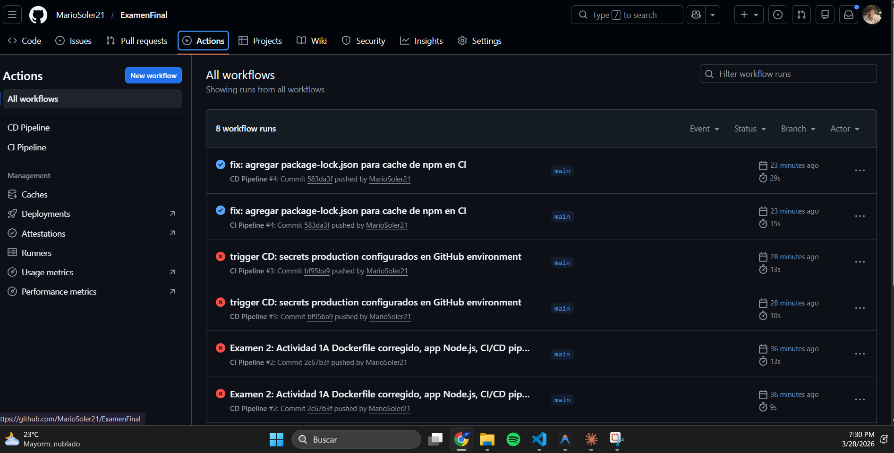
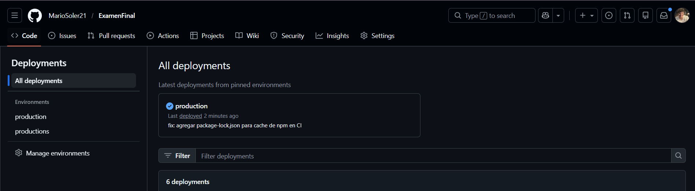

# Examen 2 - Sistemas Operativos I
**Mario Soler | CEUTEC San Pedro Sula**

---

## Evidencia de Deployment Exitoso (Actividad 3)

### Actions — CI Pipeline y CD Pipeline en verde



### Deployments — Environment production activo



- [Ver todos los workflows en Actions](https://github.com/MarioSoler21/ExamenFinal/actions)
- [Ver deployments en production](https://github.com/MarioSoler21/ExamenFinal/deployments)

---

## Estructura del Proyecto

```
.
├── .github/
│   └── workflows/
│       ├── ci.yml                   # Actividad 2: Pipeline CI (lint, test, coverage)
│       └── cd.yml                   # Actividad 3: Pipeline CD (deploy a Docker Hub)
├── Dockerfile                       # Actividad 1A: Dockerfile corregido
├── Dockerfile_broken_Act1A.txt      # Actividad 1A: Dockerfile original con errores
├── docker-compose.yml               # Actividad 1B: Compose con web + db
├── index.js                         # Aplicacion Node.js
├── package.json                     # Dependencias y scripts
├── snippet1_fixed.yml               # Actividad 4: Troubleshooting - Snippet 1
├── snippet2_fixed.yml               # Actividad 4: Troubleshooting - Snippet 2
├── snippet3_fixed.yml               # Actividad 4: Troubleshooting - Snippet 3
└── respuestas_actividad5.md         # Actividad 5: Preguntas conceptuales
```

---

## Actividad 1A — Errores corregidos en Dockerfile

| # | Error | Correccion |
|---|-------|------------|
| 1 | `FROM node:18` | `FROM node:18-alpine` — imagen mas liviana y segura |
| 2 | `npm install --production` | `npm ci --omit=dev` — flag deprecado; `npm ci` garantiza builds reproducibles |
| 3 | Sin `USER node` | `USER node` — no ejecutar el contenedor como root |
| 4 | `COPY . .` sin `--chown` | `COPY --chown=node:node . .` — el usuario correcto debe ser dueno de los archivos |

---

## Actividad 4 — Errores corregidos en snippets

**Snippet 1** — Error de sintaxis en triggers: faltaban los `:` y la indentacion YAML correcta.

**Snippet 2** — Referencia incorrecta a secrets: `secrets.VERCEL_TOKEN` debe ser `${{ secrets.VERCEL_TOKEN }}`.

**Snippet 3** — Matrix invalida: `node-version: 18` debe ser una lista `[16.x, 18.x]`.

---

## Actividad 5 — Preguntas Conceptuales

**5. ¿Cual es la diferencia fundamental entre Integracion Continua (CI) y Entrega Continua (CD)?**

CI (Integracion Continua) es el proceso de automatizar la integracion de cambios de codigo, ejecutando pruebas y validaciones en cada commit. CD (Entrega Continua) automatiza la entrega de esos cambios a un entorno de produccion o pre-produccion, permitiendo despliegues frecuentes y confiables.

**6. ¿Que es un GitHub self-hosted runner y cuando seria necesario usarlo?**

Es un servidor propio (no administrado por GitHub) que ejecuta los jobs de Actions. Es necesario cuando se requieren recursos especiales, acceso a redes privadas, o mayor control sobre el entorno de ejecucion.

**7. ¿Cual es el proposito de los GitHub environments? ¿Como se usan en workflows?**

Permiten definir entornos (ej: staging, production) con reglas y secrets especificos. Se usan en workflows para controlar despliegues, aprobaciones y acceso a secrets segun el entorno.

**8. ¿Que es una rollback strategy y como se implementaria en un pipeline de CD?**

Es un plan para revertir a una version anterior si el despliegue falla. Se implementa agregando pasos en el pipeline que restauran el estado anterior (ej: redeploy de una imagen previa, restaurar backups, o revertir cambios en infraestructura).
